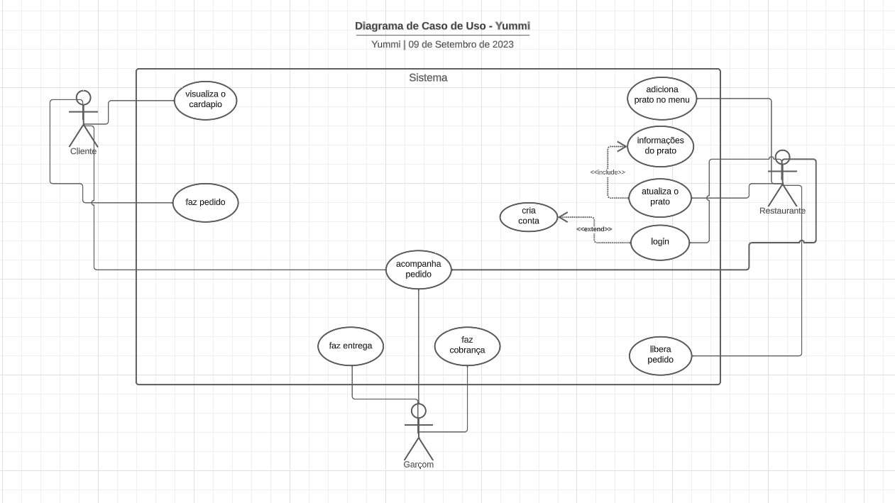

# Especificações do Projeto

Pré-requisitos: <a href="1-Documentação de Contexto.md"> Documentação de Contexto</a>

Definição do problema e ideia de solução a partir da perspectiva do usuário. É composta pela definição do  diagrama de personas, histórias de usuários, requisitos funcionais e não funcionais além das restrições do projeto.

Apresente uma visão geral do que será abordado nesta parte do documento, enumerando as técnicas e/ou ferramentas utilizadas para realizar a especificações do projeto

## Personas

|Diego Lopes|  | 
|-----------------------|-|
|Idade:|35|
|Ocupação:| Atleta Profissional |
|Aplicativos:| WhatsApp, Facebook, Instagram, LinkedIn, Aplicativos de bancos, Spotify    |
|Motivações | Busca rapidez em todas as áreas da sua vida, incluindo as refeições, Procura um cardápio digital que permita fazer pedidos rapidamente e economizar tempo   |
|Frustrações | Fica frustrado quando precisa esperar muito tempo para conseguir fazer um pedido, Fica frustrado quando o processo de escolha dos pratos é complicado e demorado. |
|Hobbies | Gosta de ler, Ouvir música, Viajar |

|Melissa Soares|  |
|-----------------------|-|
|Idade:|25|
|Ocupação:| Publicitária |
|Aplicativos:| WhatsApp, Facebook, Instagram, LinkedIn, Aplicativos de bancos, Spotify    |
|Motivações | Entusiasta da comida que adora experimentar novos sabores e culinárias, Procura um cardápio digital que ofereça uma ampla variedade de pratos interessantes e únicos |
|Frustrações | Se frustra quando encontra cardápios limitados e repetitivos, Não gosta quando não consegue ver fotos dos pratos para saber como são visualmente |
|Hobbies | Gosta de cozinhar, Adora explorar restaurantes locais durante suas viagens, Ouvir música, Viajar |

|Lucas Simão|  |
|-----------------------|-|
|Idade:|15|
|Ocupação:| Estudante do ensino médio |
|Aplicativos:| WhatsApp, Facebook, Instagram |
|Motivações | Adora sair com amigos e familiares para desfrutar de refeições, Procura um cardápio digital que facilite o compartilhamento de pedidos e a interação social durante a escolha das refeições  |
|Frustrações | Se frustra quando não consegue encontrar opções adequadas para grupos grandes ou quando os pratos chegam em tempos diferentes, dificultando a experiência compartilhada. |
|Hobbies | Andar de Skate, Ouvir música |

|Elisa Andrade |  |
|-----------------------|-|
|Idade:|75|
|Ocupação:| Dona de casa, Aposentada |
|Aplicativos:| WhatsApp |
|Motivações | Comprometida com um estilo de vida saudável e busca opções nutritivas em todas as suas refeições  |
|Frustrações | Se frustra quando não consegue encontrar informações claras sobre os ingredientes e valores nutricionais dos pratos |
|Hobbies | Gosta de ler, Assistir TV |

|Sergio Souza|  |
|-----------------------|-|
|Idade:|35|
|Ocupação:| Empresário |
|Aplicativos:| WhatsApp, Facebook, Instagram, LinkedIn, Aplicativos de bancos  |
|Motivações | Tem uma vida agitada e está sempre em movimento. Ele busca conveniência e facilidade em suas escolhas de refeições. Um cardápio digital que ofereça opções de entrega rápida é o que ele procura   |
|Frustrações | Se frustra quando os tempos de entrega são imprecisos ou quando os pedidos chegam com erros, Não gosta quando o processo de pagamento é complicado.  |
|Hobbies | Academia, Jogar tênis  |

## Histórias de Usuários

Com base na análise das personas forma identificadas as seguintes histórias de usuários:

|EU COMO... `PERSONA`| QUERO/PRECISO ... `FUNCIONALIDADE` |PARA ... `MOTIVO/VALOR`                 |
|--------------------|------------------------------------|----------------------------------------|
|Diego Lopes  | Pedir sua refeição de forma rápida e eficiente durante a pausa do almoço. | Está sempre ocupado com reuniões e treinos, então precisa economizar tempo no processo de pedido para continuar focado em suas tarefas.                |
|Melissa Soares       | Quer descobrir e experimentar pratos autênticos da culinária local.                  | É apaixonada por comida e vê cada refeição como uma oportunidade de explorar novos sabores e culturas |
|Lucas Simão       | Quer escolher pratos que sejam adequados para compartilhar com amigos durante um encontro.                  | Valoriza as experiências sociais e quer que a refeição seja uma oportunidade de se conectar e interagir com os outros.  |
|Elisa Andrade       | Quer encontrar opções de pratos saudáveis e equilibrados em um cardápio.                  | Sua prioridade é manter um estilo de vida saudável, e ela busca opções alimentares que se alinhem com sua dieta e valores nutricionais. |
|Sergio Souza       |Quer pedir comida para entrega rápida e sem complicações.                 | Está sempre em movimento e precisa de uma solução conveniente para alimentar-se enquanto continua a trabalhar.  |

## Modelagem do Processo de Negócio 

### Análise da Situação Atual

Atualmente diversas empresas (restaurantes) vem adotando o uso de cardápios digitais com o objetivo de se aproximarem de seus clientes e possíveis públicos-alvo. De forma semelhante muitas pessoas têm encontrado nessa nova modalidade de atendimento, facilidades e agilidade para fazerem seus pedidos de forma rápida e prática.  

### Descrição Geral da Proposta

Pensando nisso foi desenvolvido o projeto do aplicativo “Yummi”, que busca justamente auxiliar seus usuários na busca de restaurantes e na escolha dos cardápios disponíveis. É uma ferramenta que possibilita a seus usuários escolherem os pratos de suas preferências, não dependerem de disponibilidade de garçons, terem seus pedidos feitos diretamente na cozinha e poderem fazer o pagamento sem fila de espera no caixa. 

### Processo 1 – ATENDIMENTO PRESENCIAL EM RESTAURANTES (AS-IS)

Esse processo procura demonstrar as condições atuais como muitas pessoas fazem seus pedidos presencialmente em restaurantes. Foram identificados no fluxo abaixo alguns problemas que impactam nos serviços de atendimento presencial e consequentemente refletem no atendimento aos clientes, como por exemplo: garçom sobrecarregado, desvio de função, risco de esquecimento, favorecimento aos clientes. 

Diante desse cenário vislumbrou-se a possibilidade de desenvolver um aplicativo que auxilie clientes e restaurantes na busca de uma solução eficiente e eficaz, que os auxilie de forma rápida e prática na escolha dos cardápios disponíveis, através de uma plataforma digital elaborados dentro da plataforma. 

### Processo 2 – ATENDIMENTO VIA APP YUMMI EM RESTAURANTES (TO-BE)

Esse processo procura demonstrar as condições propostas a esses possíveis usuários (clientes e restaurantes), para que possam utilizar o aplicativo “Yummi”, o qual oferece cardápios digitais de forma simples e prática, de forma a suprir as necessidades e desejos dos usuários do sistema, auxiliando-os no controle de pedidos e atendimento ao cliente. 

## Indicadores de Desempenho

|Indicador|Objetivo|Descrição|Cálculo|Fonte de dados|Perspectiva| 
|---------|--------|---------|-------|--------------|-----------|
|Número de downloads|Avaliar o alcance e a popularidade do aplicativo|Quantidade de pessoas que baixaram o aplicativo em seus dispositivos móveis|Número total de downloads do aplicativo|Loja de aplicativos (Google Play, App Store, etc.)|Mercado|
|Taxa de conversão|Avaliar a eficácia do aplicativo em gerar vendas|Porcentagem de pessoas que acessaram o aplicativo e realizaram um pedido no restaurante|(Número de pedidos realizados pelo aplicativo / Número de acessos ao aplicativo) x 100|Aplicativo e sistema do restaurante|Financeira| 
|Tempo médio de permanência|Avaliar o engajamento e a satisfação dos usuários com o conteúdo do aplicativo|Tempo médio que as pessoas passam navegando no aplicativo|Soma dos tempos de permanência de todos os usuários / Número total de usuários|Aplicativo e ferramenta de análise (Google Analytics, etc.)|Cliente|
|Taxa de retenção|Avaliar a fidelidade e a lealdade dos usuários com o aplicativo|Porcentagem de pessoas que baixaram o aplicativo e continuam a usá-lo após um determinado período de tempo|(Número de usuários ativos no final do período / Número de usuários no início do período) x 100|Aplicativo e ferramenta de análise (Google Analytics, etc.)|Mercado| 
|Número de avaliações|Avaliar a reputação e a qualidade do aplicativo e do restaurante|Quantidade de pessoas que deixaram uma avaliação sobre o aplicativo ou o restaurante na loja de aplicativos ou em outras plataformas|Número total de avaliações recebidas pelo aplicativo ou pelo restaurante|Loja de aplicativos (Google Play, App Store, etc.) e outras plataformas (TripAdvisor, Yelp, etc.)|Cliente| 
|Taxa de abandono|Identificar possíveis problemas ou dificuldades no processo de compra do aplicativo|Porcentagem de pessoas que iniciaram um pedido no aplicativo e desistiram antes de finalizá-lo|(Número de pedidos abandonados pelo aplicativo / Número de pedidos iniciados pelo aplicativo) x 100|Aplicativo e sistema do restaurante|Processo|
|Taxa de satisfação|Avaliar a performance e a excelência do aplicativo e do restaurante|Porcentagem de pessoas que realizaram um pedido no aplicativo e ficaram satisfeitas com o produto e o serviço recebidos|(Número de avaliações positivas recebidas pelo aplicativo ou pelo restaurante / Número total de avaliações recebidas pelo aplicativo ou pelo restaurante) x 100|Loja de aplicativos (Google Play, App Store, etc.) e outras plataformas (TripAdvisor, Yelp, etc.)|Cliente|Processo| 

## Requisitos

As tabelas que se seguem apresentam os requisitos funcionais e não funcionais que detalham o escopo do projeto. Os requisitos funcionais de um sistema descrevem o que ele deve fazer, correspondem a uma funcionalidade que deve estar presente na plataforma. Já os requisitos não funcionais de um sistema descrevem como ele deve fazer, correspondem a uma característica técnica, seja de usabilidade, desempenho, confiabilidade, segurança ou outro. 

### Requisitos Funcionais

|ID    | Descrição do Requisito  | Prioridade |
|------|-----------------------------------------|----|
|RF-001| O sistema deve mostrar uma lista de pratos disponíveis no cardápio com suas respectivas descrições e preços | ALTA | 
|RF-002|O sistema deve organizar os pratos por categorias (entradas, pratos principais, sobremesas, etc.)  | ALTA |
|RF-003|O sistema deve fornecer informações detalhadas para cada prato, como ingredientes, quantidades   | MÉDIA |
|RF-004|O sistema deve permitir que os restaurantes incluam imagens de alta qualidade de cada prato para exibição aos clientes  | MÉDIA |
|RF-005|O sistema deve possibilitar que os clientes adicionem itens do cardápio ao carrinho de compras para fazer um pedido diretamente através do aplicativo   | ALTA |
|RF-006|O sistema deve permitir que os restaurantes criem contas personalizadas com informações como nome, e-mail e senha   | ALTA |
|RF-007|O sistema deve permitir que os clientes visualizem o resumo de seus pedidos antes de finalizar  | ALTA |
|RF-008|O sistema deve permitir que a equipe do restaurante receba os pedidos dos clientes em tempo real  | ALTA |
|RF-009|O sistema deve permitir os clientes sejam capazes de fazer pedidos especiais ou adicionais, como ingredientes extras, sem cebola, molhos do lado, etc | MÉDIA |
|RF-010|O sistema deve incluir instruções claras para orientar os clientes sobre como utilizar o cardápio digital corretamente  | ALTA |
|RF-011|O sistema deve permitir que os usuários façam login usando e-mail e senha.  | ALTA |

### Requisitos não Funcionais

|ID     | Descrição do Requisito  |Prioridade |
|-------|-------------------------|----|
|RNF-001| O cardápio digital deve ser compatível com uma variedade de dispositivos e navegadores, garantindo que os clientes possam acessá-lo independentemente do dispositivo que estejam usando. | ALTA | 
|RNF-002| Toda operação de inserção no sistema não deve ultrapassar 5 segundos  |  MÉDIA | 
|RNF-003| O sistema deverá manter o funcionamento de 96% do tempo em 24hrs por dia, dos 7 dias da semana. |  MÉDIA |
|RNF-004| O sistema deve ser dimensionável para lidar com picos de tráfego, como horários de pico de pedidos, sem comprometer o desempenho.  |  ALTA |

## Restrições

O projeto está restrito pelos itens apresentados na tabela a seguir.

|ID| Restrição                                             |
|--|-------------------------------------------------------|
|01| O sistema pode ser acessado apenas por dispositivos compatíveis, como smartphones, tablets e computadores, que tenham acesso à internet e suportem os navegadores e aplicativos relevantes.  |
|02| Pode haver limites para o tamanho e tipo de arquivos de imagem que podem ser carregados para os pratos no cardápio.         |
|03| A primeira etapa do projeto deverá ser entregue até o dia 03/09/2023. |
|04| A segunda etapa do projeto deverá ser entregue até o dia 01/10/2023.         |
|05| A terceira etapa do projeto deverá ser entregue até o dia 29/10/2023. |
|06| A quarta etapa do projeto deverá ser entregue até o dia 26/11/2023.         |
|07| A quinta etapa do projeto deverá ser entregue até o dia 10/12/2023.        |

## Diagrama de Casos de Uso

O diagrama de casos de uso é o próximo passo após a elicitação de requisitos, que utiliza um modelo gráfico e uma tabela com as descrições sucintas dos casos de uso e dos atores. Ele contempla a fronteira do sistema e o detalhamento dos requisitos funcionais com a indicação dos atores, casos de uso e seus relacionamentos. 

# Matriz de Rastreabilidade

Uma matriz de rastreabilidade nada mais é do que uma forma de visualização do relacionamento entre os requisitos. Por meio dela, são listados os requisitos nas linhas e nas colunas da matriz, depois se aplica um X nas células correspondentes, caracterizando os relacionamentos entre os requisitos. Dessa forma, podemos utilizar para efeitos de ilustração, um sistema com doze requisitos.

# Gerenciamento de Projeto

De acordo com o PMBoK v6 as dez áreas que constituem os pilares para gerenciar projetos, e que caracterizam a multidisciplinaridade envolvida, são: Integração, Escopo, Cronograma (Tempo), Custos, Qualidade, Recursos, Comunicações, Riscos, Aquisições, Partes Interessadas. Para desenvolver projetos um profissional deve se preocupar em gerenciar todas essas dez áreas. Elas se complementam e se relacionam, de tal forma que não se deve apenas examinar uma área de forma estanque. É preciso considerar, por exemplo, que as áreas de Escopo, Cronograma e Custos estão muito relacionadas. Assim, se eu amplio o escopo de um projeto eu posso afetar seu cronograma e seus custos.

## Gerenciamento de Tempo

O gráfico de Gantt é uma ferramenta de gerenciamento de projetos que exibe visualmente as atividades do projeto ao longo do tempo, ele ajuda os gerentes de projeto a visualizar o cronograma do projeto, identificar possíveis problemas e ajustar o plano do projeto, se necessário. Ele também permite que as equipes trabalhem de forma mais eficiente, fornecendo uma visão geral do progresso do projeto e das tarefas pendentes. 

Trazendo para nosso contexto, o gráfico de Gantt é uma representação gráfica das atividades envolvidas no desenvolvimento do aplicativo, mostrando as datas de início e término previstas para cada atividade. 

Para esse fim, construímos o gráfico de Gantt conforme disposto na figura 3. Ele contém uma lista de tarefas ou atividades na vertical e um eixo horizontal que representa o tempo. As barras horizontais representam a duração de cada atividade e a posição das barras no eixo do tempo indica quando cada atividade deve começar e terminar.

## Gerenciamento de Equipe

O gerenciamento adequado de tarefas contribuirá para que o projeto alcance altos níveis de produtividade. Por isso, é fundamental que ocorra a gestão de tarefas e de pessoas, de modo que os times envolvidos no projeto possam ser facilmente gerenciados. 

## Gestão de Orçamento

O processo de determinar o orçamento do projeto é uma tarefa que depende, além dos produtos (saídas) dos processos anteriores do gerenciamento de custos, também de produtos oferecidos por outros processos de gerenciamento, como o escopo e o tempo.

